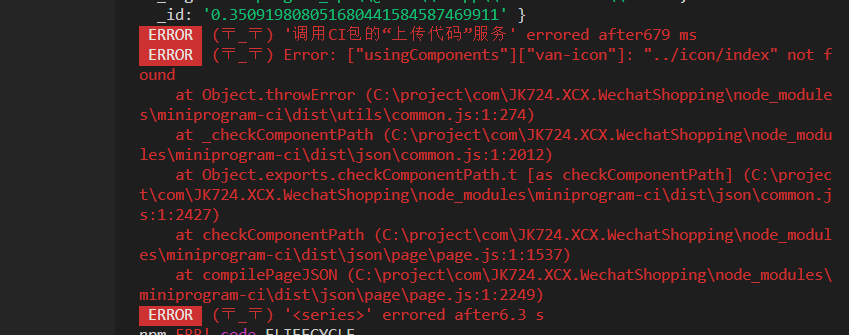

## 重现环境
window10 企业版 64位系统
nodejs v10.16.3
npm 6.11.3

注意：mac os系统上没有此问题

## 重现步骤
1. 用小程序开发者工具新建立一个项目， npm init
2. 安装 `npm i @vant/weapp -S --production` 和 `npm i miniprogram-ci -D`
3. 修改项目目录下的 build.js, 修改其中的appid和私钥，后台关闭白名单
4. 终端运行命令 `node build.js`，构建npm成功，上传失败

## 运行错误

"构建npm" 步骤运行成功了，“CI上传代码“那个步骤报错了，具体错误：
### "miniprogram-ci": "1.0.11" 版本错误信息：
``` bash
(node:21612) UnhandledPromiseRejectionWarning: Error: ["usingComponents"]["van-icon"]: "../icon/ind
ex" not found
    at Object.throwError (C:\project\github\bug\node_modules\miniprogram-ci\dist\utils\common.js:1:
274)
    at _checkComponentPath (C:\project\github\bug\node_modules\miniprogram-ci\dist\json\common.js:1
:2012)
    at Object.exports.checkComponentPath.t [as checkComponentPath] (C:\project\github\bug\node_modu
les\miniprogram-ci\dist\json\common.js:1:2427)
    at checkComponentPath (C:\project\github\bug\node_modules\miniprogram-ci\dist\json\page\page.js
:1:1537)
    at compilePageJSON (C:\project\github\bug\node_modules\miniprogram-ci\dist\json\page\page.js:1:
2249)
(node:21612) UnhandledPromiseRejectionWarning: Unhandled promise rejection. This error originated e
ither by throwing inside of an async function without a catch block, or by rejecting a promise whic
h was not handled with .catch(). (rejection id: 1)
(node:21612) [DEP0018] DeprecationWarning: Unhandled promise rejections are deprecated. In the futu
re, promise rejections that are not handled will terminate the Node.js process with a non-zero exit
 code.
```

### "miniprogram-ci": "1.0.12"版本错误信息：


```
(node:23640) UnhandledPromiseRejectionWarning: Error: ["usingComponents"]["van-icon"]: "../icon/index" not found
    at Object.throwError (C:\project\github\bug\node_modules\miniprogram-ci\dist\utils\common.js:1:274)
    at _checkComponentPath (C:\project\github\bug\node_modules\miniprogram-ci\dist\json\common.js:1:2120)
    at Object.exports.checkComponentPath.t [as checkComponentPath] (C:\project\github\bug\node_modules\miniprogram-ci\dist\json\common.js:1:2535)
    at checkComponentPath (C:\project\github\bug\node_modules\miniprogram-ci\dist\json\page\page.js:1:1537)
    at compilePageJSON (C:\project\github\bug\node_modules\miniprogram-ci\dist\json\page\page.js:1:2249)
(node:23640) UnhandledPromiseRejectionWarning: Unhandled promise rejection. This error originated either by throwing inside of an async function without a
catch block, or by rejecting a promise which was not handled with .catch(). (rejection id: 1)
(node:23640) [DEP0018] DeprecationWarning: Unhandled promise rejections are deprecated. In the future, promise rejections that are not handled will terminate the Node.js process with a non-zero exit code.
```

checkComponentPath 函数的判断逻辑有问题


## 对照说明
如果使用开发者工具自带的”构建npm“\ ”上传“功能，则无此报错；
如果不使用有赞的@vant/weapp库，miniprogram-ci 也可以上传成功
